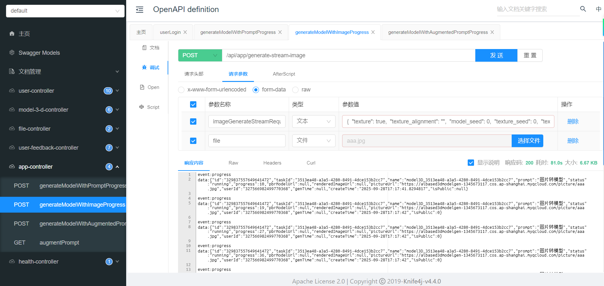

# AI 3D模型生成后端

作者：https://github.com/RJLante

## 项目简介

本项目是一个基于AI的3D模型生成后端服务。它通过调用 Tripo API 支持文生模型和图生模型两种模式。该服务还集成了用户管理、使用大语言模型增强提示词以及使用腾讯云COS进行文件存储等功能。

## 主要功能

* **文生模型**: 根据文本描述生成3D模型。

* **图生模型**: 根据输入的图片生成3D模型。

* **SSE 流式输出**: 使用 Server-Sent Events + Reactor 流式输出 API 生成结果。

* **提示词增强**: 使用 LangChain4j 调用大语言模型（deepseek-chat）来优化和增强用户输入的提示词，以生成更高质量的模型。

* **用户管理**: 提供完整的用户注册、登录和用户信息管理功能。

* **模型管理**: 允许对生成的3D模型进行管理。

* **用户反馈**: 用户可以提交反馈，管理员可以对反馈进行管理。

* **并发模型生成请求处理**: 使用自定义线程池来高效处理对模型生成API的并发请求。

*   **云存储集成**:
    
    *   用户上传的图片存储在腾讯云对象存储（COS）中。
    *   从Tripo API返回的模型和预览图会先被下载，然后上传到腾讯云COS。
    *   删除本地临时文件以节省服务器空间。
    
* **权限校验**: 采用AOP（面向切面编程）和自定义权限接口相结合的方式，实现灵活且强大的访问控制。

* **API文档**: 集成 [Knife4j](https://doc.xiaominfo.com/)，提供清晰、可交互的API文档。

  

## 技术栈

*   **核心框架**: Spring Boot
*   **数据库**: MySQL
*   **ORM框架**: MyBatis-Plus
*   **大语言模型集成**: LangChain4j deepseek-chat
*   **云存储**: 腾讯云 COS
*   **API文档**: Knife4j
*   **认证与授权**: 自定义AOP权限校验方案

## 环境配置

*   Java 21 或更高版本
*   Maven
*   MySQL 8.0 或更高版本
*   腾讯云账户及COS存储桶

